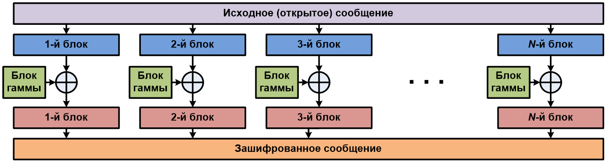

---
## Front matter
lang: ru-RU
title: Математические основы защиты информации и информационной безопасности
title: Лабораторная работа №3:Шифрование гаммированием
author: Кодже Лемонго Арман
institute: Российский Университет Дружбы Народов
date: 10 октября, 2024, Москва, Россияp
## Formatting
mainfont: PT Serif
romanfont: PT Serif
sansfont: PT Sans
monofont: PT Mono
toc: false
slide_level: 2
theme: metropolis
header-includes: 
 - \metroset{progressbar=frametitle,sectionpage=progressbar,numbering=fraction}
 - '\makeatletter'
 - '\beamer@ignorenonframefalse'
 - '\makeatother'
aspectratio: 169
section-titles: true

---


## Цель лабораторной работы
Изучение алгоритма шифрования гаммированием

## Выполнение лабораторной работы

Гаммирование – это наложение (снятие) на открытые (зашифрованные) данные криптографической гаммы, т.е. последовательности элементов данных, вырабатываемых с помощью некоторого криптографического алгоритма, для получения зашифрованных (открытых) данных.

## Гаммирование

Наложение (или снятие) гаммы на блок сообщения в рассматриваемом нами стандарте реализуется с помощью операции побитного сложения по модулю 2 (XOR). То есть при шифровании сообщений каждый блок открытого сообщения ксорится с блоком криптографической гаммы, длина которого должна соответствовать длине блоков открытого сообщения. При этом, если размер блока исходного текста меньше, чем размер блока гаммы, блок гаммы обрезается до размера блока исходного текста (выполняется процедура усечения гаммы).

## Алгоритм

{ #fig:001 }

## Алгоритм

{ #fig:002 }

## Формула

В аддитивных шифрах символы исходного сообщения заменяются числами, которые складываются по модулю с числами гаммы. Ключом шифра является гамма, символы которой последовательно повторяются.
Перед шифрованием символы сообщения и гаммы заменяются их номерами в алфавите и само кодирование выполняется по формуле

$$ Ci = (Ti+Gi) mod N $$

## Пример работы алгоритма

{ #fig:003 }

## Реализация шифратора и дешифратора 

```
def main():
    dict = {"а" :1, "б" :2 , "в" :3 ,"г" :4 ,"д" :5 ,"е" :6 ,"ё" :7 ,"ж": 8, "з": 9, "и": 10, "й": 11, "к": 12, "л": 13,
            "м": 14, "н": 15, "о": 16, "п": 17,
            "р": 18, "с": 19, "т": 20, "у": 21, "ф": 22, "х": 23, "ц": 24, "ч": 25, "ш": 26, "щ": 27, "ъ": 28,
            "ы": 29, "ь": 30, "э": 31, "ю": 32, "я": 32
            }
    dict2 = {v: k for k, v in dict.items()}
    gamma = input("Введите гамму(на русском языке! Да и пробелы тоже нельзя! Короче, только символы из dict").lower()
    text = input("Введите текст для шифрования").lower()
    listofdigitsoftext = list()
    listofdigitsofgamma = list()
    for i in text:
        listofdigitsoftext.append(dict[i])
    print("Числа текста", listofdigitsoftext)
    for i in gamma:
        listofdigitsofgamma.append(dict[i])
    print("числа гаммы", listofdigitsofgamma)
    listofdigitsresult = list()
    ch = 0
    for i in text:
        try:
            a = dict[i] + listofdigitsofgamma[ch]
        except:
            ch=0
            a = dict[i] + listofdigitsofgamma[ch]
        if a>=33:
            a = a%33
        ch+=1
        listofdigitsresult.append(a)
    print("Числа зашифрованного текста", listofdigitsresult)
    textencrypted=""
    for i in listofdigitsresult:
        textencrypted+=dict2[i]
    print("Зашифрованный текст: ", textencrypted)
    listofdigits = list()
    for i in textencrypted:
        listofdigits.append(dict[i])
    ch = 0
    listofdigits1 = list()
    for i in listofdigits:
        a = i - listofdigitsofgamma[ch]
        if a < 1:
            a = 33 + a
        listofdigits1.append(a)
        ch+=1
    textdecrypted = ""
    for i in listofdigits1:
        textdecrypted+=dict2[i]
    print("Decrypted text", textdecrypted)
```

## Пример работы программы

{ #fig:004 }

## Выводы

Изучили алгоритм шифрования с помощью гаммирования