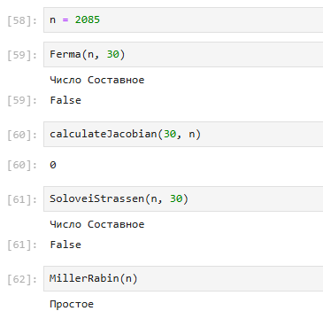

---
# Front matter
title: "Отчёт по лабораторной работе №5"
subtitle: "Вероятностные алгоритмы проверки чисел на простоту"
author: "Кодже Лемонго Арман"

# Generic otions
lang: ru-RU
toc-title: "Содержание"

# Bibliography
bibliography: bib/cite.bib
csl: pandoc/csl/gost-r-7-0-5-2008-numeric.csl

# Pdf output format
toc: true # Table of contents
toc_depth: 2
lof: true # List of figures
fontsize: 12pt
linestretch: 1.5
papersize: a4
documentclass: scrreprt
## I18n
polyglossia-lang:
  name: russian
  options:
	- spelling=modern
	- babelshorthands=true
polyglossia-otherlangs:
  name: english
### Fonts
mainfont: PT Serif
romanfont: PT Serif
sansfont: PT Sans
monofont: PT Mono
mainfontoptions: Ligatures=TeX
romanfontoptions: Ligatures=TeX
sansfontoptions: Ligatures=TeX,Scale=MatchLowercase
monofontoptions: Scale=MatchLowercase,Scale=0.9
## Biblatex
biblatex: true
biblio-style: "gost-numeric"
biblatexoptions:
  - parentracker=true
  - backend=biber
  - hyperref=auto
  - language=auto
  - autolang=other*
  - citestyle=gost-numeric
## Misc options
indent: true
header-includes:
  - \linepenalty=10 # the penalty added to the badness of each line within a paragraph (no associated penalty node) Increasing the value makes tex try to have fewer lines in the paragraph.
  - \interlinepenalty=0 # value of the penalty (node) added after each line of a paragraph.
  - \hyphenpenalty=50 # the penalty for line breaking at an automatically inserted hyphen
  - \exhyphenpenalty=50 # the penalty for line breaking at an explicit hyphen
  - \binoppenalty=700 # the penalty for breaking a line at a binary operator
  - \relpenalty=500 # the penalty for breaking a line at a relation
  - \clubpenalty=150 # extra penalty for breaking after first line of a paragraph
  - \widowpenalty=150 # extra penalty for breaking before last line of a paragraph
  - \displaywidowpenalty=50 # extra penalty for breaking before last line before a display math
  - \brokenpenalty=100 # extra penalty for page breaking after a hyphenated line
  - \predisplaypenalty=10000 # penalty for breaking before a display
  - \postdisplaypenalty=0 # penalty for breaking after a display
  - \floatingpenalty = 20000 # penalty for splitting an insertion (can only be split footnote in standard LaTeX)
  - \raggedbottom # or \flushbottom
  - \usepackage{float} # keep figures where there are in the text
  - \floatplacement{figure}{H} # keep figures where there are in the text
---

# Цель работы

Изучение Вероятностные алгоритмы проверки чисел на простоту : алгоритмов Ферма, вычисления символа якоби, Соловэя-Штрассена, Миллера-Рабина.

# Теоретические сведения

Действительно, стойкость алгоритма RSA основана на возможности выбора простых чисел, состоящих из не менее 100 десятичных знаков. Поиск таких чисел последовательным перебором всех нечетных, начиная с некоторого стартового, и последующим «просеиванием» через решето Эратосфена весьма затруднителен. Проблему решают обходным маневром и решают «приближенно», а точнее — «вероятностно». Возможного кандидата на простое число подвергают испытанию серией однотипных и легко осуществимых тестов. Положительность результата хотя бы одного теста однозначно свидетельствует о том, что кандидат является числом составным; с другой стороны, отрицательный результат теста не дает абсолютной гарантии простоты кандидата, но свидетельствует о том, что вероятность его быть составным уменьшилась на определенную величину, скажем, в два раза. Тогда с увеличением количества отрицательных результатов все меньше шансов у испытуемого числа оказаться составным. Организовав серию испытаний из большого количества — например, 100 — тестов и получив все их результаты отрицательными, мы имеем право сказать, что кандидат является скорее всего («вроде бы») простым, с вероятностью не менее. Для таких чисел используют название вероятностно простые числа. Мы изложим здесь два способа организации упомянутой серии тестов, при этом тестируемое число будем обозначать.

## Алгоритм, реализующий тест Ферма

* Вход. Нечетное целое число $n \geq 5$.
* Выход. «Число n, вероятно, простое» или «Число n составное».

1. Выбрать случайное целое число $a, 2 \leq a \leq n-2$.
2. Вычислить $r=a^{n-1} (mod n)$
3. При $r=1$ результат: «Число n, вероятно, простое». В противном случае результат: «Число n составное».

## Алгоритм вычисления символа якоби

1. Если НОД (a, b)≠1, выход из алгоритма с ответом 0.
2. Инициализация. r=1
3. Переход к положительным числам. Если a<0, то a=-a. Если b mod 4 = 3, то r=-r 
4. Избавление от чётности. t=0. Цикл ПОКА a — чётное, t=t+1, a=a/2. Конец цикла. Если t — нечётное, то Если b mod 8 = 3 или 5, то r=-r. 
5. Вычисление символа Якоби. 14 При перестановке аргументов больший заменяется на остаток от деления на меньший. Это возможно благодаря периодичности символа Якоби. 
Сложность алгоритма равна O(log a ⋅ log b) битовых операций. 

## Алгоритм, реализующий Тест Соловэя-Штрассена

* Вход. Нечетное целое число $n \geq 5$.
* Выход. «Число n, вероятно, простое» или «Число n составное».

1. Выбрать случайное целое число $a, 2 \leq a \leq n-2$.
2. Вычислить $r=a^{(\frac{n-1}{2})} (mod n)$
3. При $r \neq 1$ и $r \neq n-1$ результат: «Число n составное».
4. Вычислить символ Якоби $s = (\frac{a}{n})$
5. При $r=s (mod n)$ результат: «Число n, вероятно, простое». В противном случае результат: «Число n составное».

## Алгоритм, реализующий Тест Миллера-Рабина.

* Вход. Нечетное целое число $n \geq 5$.
* Выход. «Число n, вероятно, простое» или «Число n составное».

1. Представить $n-1$ в виде $n-1 = 2^sr$, где r - нечетное число
2. Выбрать случайное целое число $a, 2 \leq a \leq n-2$.
3. Вычислить $y=a^r (mod n)$
4. При $y \neq 1$ и $y \neq n-1$ выполнить действия
	- Положить $j=1$
	- Если $j \leq s-1$ и $y \neq n-1$ то
		* Положить $y=y^2 (mod n)$
		* При $y=1$   результат: «Число n составное».
		* Положить $j=j+1$
	- При $y \neq n-1$ результат: «Число n составное».
5. Результат: «Число n, вероятно, простое».

# Выполнение работы

## Реализация алгоритмов на языке Python

```
import random

- Алгоритм, реализующий тест Ферма

def Ferma(n, test_count):
    for i in range(test_count):
        a = random.randint(2, n-1)
        if ( a**(n-1)%n != 1 ):
            print("Число Составное")
            return False
    print("Вероятно, Простое")
    return True

- Алгоритм вычисления символа якоби 

def calculateJacobian(a, n):
    if (a == 0):
        return 0
    ans = 1
    if (a < 0):
        a = -a
        if (n%4 == 3):
            ans = -ans
    if (a == 1):
        return ans
    while (a):
        if (a < 0):
            a = -a
            if (n%4 == 3):
                ans = -ans
        while (a%2 == 0):
            a = a//2
            if (n%8 == 3 or n%8 == 5):
                ans = -ans
        a, n = n, a
        if (a%4 == 3 and n%4 == 3):
            ans = -ans
        a = a%n
        if (a > n//2):
            a = a - n
    if(n == 1):
        return ans
    return 0

- Алгоритм, реализующий Тест Соловэя-Штрассена

def SoloveiStrassen(p, iterations):
    if (p < 2):
        print("Число Составное")
        return False
    if (p != 2 and p%2 == 0):
        print("Число Составное")
        return False
    for i in range(iterations):
       a = random.randrange(p - 1) + 1
    jacobian = (p + calculateJacobian(a, p))%p
    mod = modulo(a, (p - 1)/2, p)
    if (jacobian == 0 or mod != jacobian):
        print("Число Составное")
        return False
    return True

- Алгоритм, реализующий Тест Миллера-Рабина 

def MillerRabin(n):
    if n != int(n):
        print("Число Составное")
        return False
    n = int(n)
    if n == 0 or n == 1 or n == 4 or n == 6 or n == 8 or n == 9:
        print("Число Составное")
        return False
    if n == 2 or n == 3 or n == 5 or n == 7:
        print("Простое")
        return True
    s = 0
    d = n - 1
    while d%2 == 0:
        d >>= 1
        s += 1
    assert(2**s*d == n-1)
    
    def trial_compose(a):
        if pow(a, d, n) == 1:
            print("Число Составное")
            return False
        for i in range(s):
            if pow(a, 2**i*d, n) == n - 1:
                print("Число Составное")
                return False
        print("Вероятно, Простое")
        return True
    
    for i in range(8):
        a = random.randrange(2, n)
        if trial_compose(a):
            print("Число Составное")
            return False
    print("Вероятно, Простое")
    return True
```

## Контрольный пример

{ #fig:001 }

# Выводы

Изучили алгоритмы Ферма, вычисления символа якоби, Соловэя-Штрассена, Миллера-Рабина.

# Список литературы{.unnumbered}

1. [ проверка чисел на простоту](hhttps://spravochnick.ru/informatika/algoritmizaciya/proverka_chisel_na_prostotu/)
2. [Исследование алгоритмов генерации простых чисел](https://moluch.ru/archive/90/18929/)
3. [Вероятностно простые числа](https://vmath.ru/vf5/crypto/pprime)