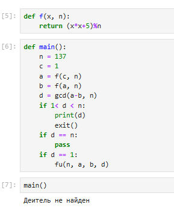

---
# Front matter
title: "Отчёт по лабораторной работе №6"
subtitle: "Разложение чисел на множители"
author: "Кодже Лемонго Арман"

# Generic otions
lang: ru-RU
toc-title: "Содержание"

# Bibliography
bibliography: bib/cite.bib
csl: pandoc/csl/gost-r-7-0-5-2008-numeric.csl

# Pdf output format
toc: true # Table of contents
toc_depth: 2
lof: true # List of figures
fontsize: 12pt
linestretch: 1.5
papersize: a4
documentclass: scrreprt
## I18n
polyglossia-lang:
  name: russian
  options:
	- spelling=modern
	- babelshorthands=true
polyglossia-otherlangs:
  name: english
### Fonts
mainfont: PT Serif
romanfont: PT Serif
sansfont: PT Sans
monofont: PT Mono
mainfontoptions: Ligatures=TeX
romanfontoptions: Ligatures=TeX
sansfontoptions: Ligatures=TeX,Scale=MatchLowercase
monofontoptions: Scale=MatchLowercase,Scale=0.9
## Biblatex
biblatex: true
biblio-style: "gost-numeric"
biblatexoptions:
  - parentracker=true
  - backend=biber
  - hyperref=auto
  - language=auto
  - autolang=other*
  - citestyle=gost-numeric
## Misc options
indent: true
header-includes:
  - \linepenalty=10 # the penalty added to the badness of each line within a paragraph (no associated penalty node) Increasing the value makes tex try to have fewer lines in the paragraph.
  - \interlinepenalty=0 # value of the penalty (node) added after each line of a paragraph.
  - \hyphenpenalty=50 # the penalty for line breaking at an automatically inserted hyphen
  - \exhyphenpenalty=50 # the penalty for line breaking at an explicit hyphen
  - \binoppenalty=700 # the penalty for breaking a line at a binary operator
  - \relpenalty=500 # the penalty for breaking a line at a relation
  - \clubpenalty=150 # extra penalty for breaking after first line of a paragraph
  - \widowpenalty=150 # extra penalty for breaking before last line of a paragraph
  - \displaywidowpenalty=50 # extra penalty for breaking before last line before a display math
  - \brokenpenalty=100 # extra penalty for page breaking after a hyphenated line
  - \predisplaypenalty=10000 # penalty for breaking before a display
  - \postdisplaypenalty=0 # penalty for breaking after a display
  - \floatingpenalty = 20000 # penalty for splitting an insertion (can only be split footnote in standard LaTeX)
  - \raggedbottom # or \flushbottom
  - \usepackage{float} # keep figures where there are in the text
  - \floatplacement{figure}{H} # keep figures where there are in the text
---

# Цель работы

Целью данной является Изучение p-алгоритма Поллрада и разложить на множители.

# Теоретические сведения

Разложение на множители — это процесс представления алгебраического выражения, такого как многочлен, в виде произведения более простых выражений или множителей. Этот метод позволяет упростить сложные уравнения и облегчить их решение.

Согласно Основной теореме арифметики любое положительное целое число больше единицы может быть уникально записано в следующей главной форме разложения на множители, где $p_1, p_2, ..., p_k$ — простые числа и $e_1, e_2, ..., e_k$ — положительные целые числа.

$$n=p^{e_1}_1 * p^{e_2}_2 * ... * p^{e_k}_k$$

К сожалению, совершенный алгоритм для этого пока не найден. Хотя есть несколько алгоритмов, которые могут разложить число на множители, ни один не способен провести разложение достаточно больших чисел в разумное время. Позже мы увидим, что это хорошо для криптографии, потому что современные криптографические системы полагаются на этот факт. В этой секции мы даем несколько простых алгоритмов, которые проводят разложение составного числа. Цель состоит в том, чтобы сделать процесс разложения на множители менее трудоёмким.

 Заметим, что этот метод требует сделать $B – 1$ операций возведения в степень $a = a^e mod n$. Есть быстрый алгоритм возведения в степень, который выполняет это за $2*1og_2 B$ операций. Метод также использует вычисления НОД, который требует $n^3$ операций. Мы можем сказать, что сложность — так или иначе больше, чем $O(B)$ или $O(2^n)$, где $n_b$ — число битов в $B$. Другая проблема – этот алгоритм может заканчиваться сигналом об ошибке. Вероятность успеха очень мала, если $B$ имеет значение, не очень близкое к величине $\sqrt{n}$.

## p-алгоритм Поллрада

* Вход. Число $n$, начальное значение $c$, функция $f$, обладающая сжимающими свойствами.
* Выход. Нетривиальный делитель числа $n$.

1. Положить $a=c, b=c$
2. Вычислить $a=f(a)(mod n), b=f(b)(mod n)$
3. Найти $d = GCD(a-b, n)$
4. Если $1<d<n$, то положить $p=d$ и результат: $p$. При $d=n$ результат: ДЕЛИТЕЛЬ НЕ НАЙДЕН. При $d=1$ вернуться на шаг 2.

# Выполнение работы

## Реализация алгоритма на языке Python

```
Алгоритм, реализующий р-метод Полларда

from math import gcd

def fu(n, a, b, d):
    a = f(a, n)
    b = f(f(b, n), n)
    d = gcd(a-b, n)
    if 1<d<n:
        print(d)
        exit()
    if d == n:
        print("Деитель не найден")
    if d == 1:
        fu(n, a, b, d)

Разложить на множители данное преподавателем число

def f(x, n):
    return (x*x+5)%n

def main():
    n = 1359331
    c = 1
    a = f(c, n)
    b = f(a, n)
    d = gcd(a-b, n)
    if 1< d < n:
        print(d)
        exit()
    if d == n:
        pass
    if d == 1:
        fu(n, a, b, d)
```
## Контрольный пример

{ #fig:001 }
{ #fig:001 }

# Выводы

в конце нашего лабораторная работа, я изучил задачу разложения на множители и p-алгоритм Поллрада. P-алгоритм Полларда представляет собой мощный инструмент для разложения на множители, который сочетает в себе теоретические основы и практическое применение в области вычислительной математики.

# Список литературы{.unnumbered}

1. [Разложение на множители](https://infourok.ru/razlozhenie-na-mnozhiteli-mnogochlena-3-sposoba-4385153.html)
2. [Альгоритм P-метод Полларда](https://habr.com/ru/sandbox/163811/)

