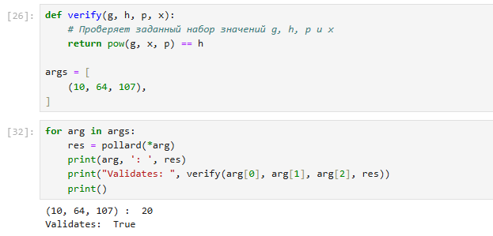

---
# Front matter
title: "Отчёт по лабораторной работе №7"
subtitle: "Дискретное логарифмирование в конечном поле"
author: "Кодже Лемонго Арман"

# Generic otions
lang: ru-RU
toc-title: "Содержание"

# Bibliography
bibliography: bib/cite.bib
csl: pandoc/csl/gost-r-7-0-5-2008-numeric.csl

# Pdf output format
toc: true # Table of contents
toc_depth: 2
lof: true # List of figures
fontsize: 12pt
linestretch: 1.5
papersize: a4
documentclass: scrreprt
## I18n
polyglossia-lang:
  name: russian
  options:
	- spelling=modern
	- babelshorthands=true
polyglossia-otherlangs:
  name: english
### Fonts
mainfont: PT Serif
romanfont: PT Serif
sansfont: PT Sans
monofont: PT Mono
mainfontoptions: Ligatures=TeX
romanfontoptions: Ligatures=TeX
sansfontoptions: Ligatures=TeX,Scale=MatchLowercase
monofontoptions: Scale=MatchLowercase,Scale=0.9
## Biblatex
biblatex: true
biblio-style: "gost-numeric"
biblatexoptions:
  - parentracker=true
  - backend=biber
  - hyperref=auto
  - language=auto
  - autolang=other*
  - citestyle=gost-numeric
## Misc options
indent: true
header-includes:
  - \linepenalty=10 # the penalty added to the badness of each line within a paragraph (no associated penalty node) Increasing the value makes tex try to have fewer lines in the paragraph.
  - \interlinepenalty=0 # value of the penalty (node) added after each line of a paragraph.
  - \hyphenpenalty=50 # the penalty for line breaking at an automatically inserted hyphen
  - \exhyphenpenalty=50 # the penalty for line breaking at an explicit hyphen
  - \binoppenalty=700 # the penalty for breaking a line at a binary operator
  - \relpenalty=500 # the penalty for breaking a line at a relation
  - \clubpenalty=150 # extra penalty for breaking after first line of a paragraph
  - \widowpenalty=150 # extra penalty for breaking before last line of a paragraph
  - \displaywidowpenalty=50 # extra penalty for breaking before last line before a display math
  - \brokenpenalty=100 # extra penalty for page breaking after a hyphenated line
  - \predisplaypenalty=10000 # penalty for breaking before a display
  - \postdisplaypenalty=0 # penalty for breaking after a display
  - \floatingpenalty = 20000 # penalty for splitting an insertion (can only be split footnote in standard LaTeX)
  - \raggedbottom # or \flushbottom
  - \usepackage{float} # keep figures where there are in the text
  - \floatplacement{figure}{H} # keep figures where there are in the text
---

# Цель работы

Целью данной является изучение задачи дискретного логарифмирования.

# Теоретические сведения


Дискретное логарифмирование (DLOG) — задача обращения функции 
g^{x} в некоторой конечной мультипликативной группе G
.Наиболее часто задачу дискретного логарифмирования рассматривают в мультипликативной группе кольца вычетов или конечного поля, а также в группе точек эллиптической кривой над конечным полем. Эффективные алгоритмы для решения задачи дискретного логарифмирования в общем случае неизвестны.

Для заданных g и a решение x уравнения g^{x}=a называется дискретным логарифмом элемента a по основанию g. В случае, когда G является мультипликативной группой кольца вычетов по модулю m, решение называют также индексом числа a по основанию g. Индекс числа a по основанию g гарантированно существует, если g является первообразным корнем по модулю m.

## p-алгоритм Поллрада

* Вход. Простое число $p$, число $a$ порядка $r$ по модулю $p$, целое число $b$б $1 < b < p$; отображение $f$, обладающее сжимающими свойствами и сохраняющее вычислимость логарифма.
* Выход. показатель $x$, для которого $a^x=b(mod p)$, если такой показатель существует.

1. Выбрать произвольные целые числа $u, v$ и положить $c=a^u b^v (mod p), d=c$
2. Выполнять $c=f(c)(mod p), d=f(f(d))(mod p), вычисляя при этом логарифмы для $c$ и $d$ как линейные функции от $x$ по модулю $r$, до получения равенства $c=d (mod p)$
3. Приняв логарифмы для $c$ и $d$, вычислить логарифм $x$ решением сравнения по модулю $r$. Результат $x$ или РЕШЕНИЯ НЕТ.

# Выполнение работы

## Реализация алгоритма на языке Python

```
def ext_euclid(a, b):
    # Extended Euclidean Algorithm
    # param a, param b:
    if b == 0:
        return a, 1, 0
    else:
        d, xx, yy = ext_euclid(b, a % b)
        x = yy
        y = xx - (a // b) * yy
        return d, x, y

def inverse(a, n):
    #Inverse of a in mod n
    #param a, param n:
    return ext_euclid(a, n)[1]

def xab(x, a, b, xxx_todo_changeme):
    # Pollard Step
    # param x, param a, param b:
  
    (G, H, P, Q) = xxx_todo_changeme
    sub = x % 3 # Subsets

    if sub == 0:
        x = x*xxx_todo_changeme[0] % xxx_todo_changeme[2]
        a = (a+1) % Q

    if sub == 1:
        x = x * xxx_todo_changeme[1] % xxx_todo_changeme[2]
        b = (b + 1) % xxx_todo_changeme[2]

    if sub == 2:
        x = x*x % xxx_todo_changeme[2]
        a = a*2 % xxx_todo_changeme[3]
        b = b*2 % xxx_todo_changeme[3]

    return x, a, b

def pollard(G, H, P):

    Q = int((P - 1) // 2)  # подгруппа

    x = G*H
    a = 1
    b = 1

    X = x
    A = a
    B = b

    # Не используйте здесь range(). Это делает алгоритм удивительно медленным.
    for i in range(1, P):
        # Кому нужна сквозная ссылка, когда у вас есть Python!!! ;
        # Hedgehog
        x, a, b = xab(x, a, b, (G, H, P, Q))
        # Rabbit
        X, A, B = xab(X, A, B, (G, H, P, Q))
        X, A, B = xab(X, A, B, (G, H, P, Q))
        if x == X:
            break

    nom = a-A
    denom = B-b

    # print nom, denom
    # Для правильного вычисления дроби необходимо вычислить обратное значение mod q
    res = (inverse(denom, Q) * nom) % Q

    # так никто не делает но все же...
    if verify(G, H, P, res):
        return res

    return res + Q

def verify(g, h, p, x):
    # Проверяет заданный набор значений g, h, p и x
    return pow(g, x, p) == h

args = [ (10, 64, 107),]

for arg in args:
    res = pollard(*arg)
    print(arg, ': ', res)
    print("Validates: ", verify(arg[0], arg[1], arg[2], res))
    print()
```

## Контрольный пример

{ #fig:001 }

# Выводы

в конце нашего лабораторная работа, я изучил задачу дискретного логарифмирования.

# Список литературы{.unnumbered}

1. [Дискретный логарифм](https://translated.turbopages.org/proxy_u/en-ru.ru.f8961c64-6751851f-1225bc62-74722d776562/https/en.wikipedia.org/wiki/Discrete_logarithm)
2. [Вычислительная сложность и приложения в криптографии](https://ru.ruwiki.ru/wiki/%D0%94%D0%B8%D1%81%D0%BA%D1%80%D0%B5%D1%82%D0%BD%D0%BE%D0%B5_%D0%BB%D0%BE%D0%B3%D0%B0%D1%80%D0%B8%D1%84%D0%BC%D0%B8%D1%80%D0%BE%D0%B2%D0%B0%D0%BD%D0%B8%D0%B5)
3. [Дискретное логарифмирование в конечномерной алгебре над полем](https://cyberleninka.ru/article/n/diskretnoe-logarifmirovanie-v-konechnomernoy-algebre-nad-polem)